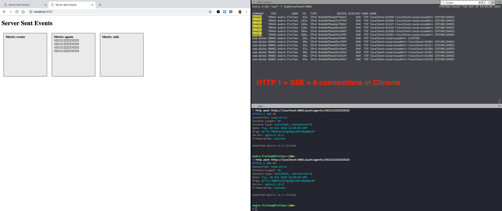
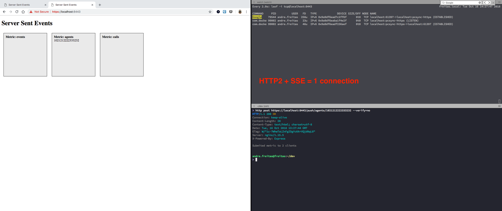

# Websocket vs SSE
Example project where you can subscribe to metrics on the frontend and push metrics from the backend with the following approaches:
- SSE with HTTP1
- SSE with HTTP2
- Websockets

## SSE
By using HTTP2, we only need one connection in client side for maintaining all subscriptions. From the backend perspective, it is still multiple connections.

### HTTP1


### HTTP2



### Draft of Queries Subscriptions Protocol
```

                         +-----------+                                                                                               +---------------+
                         | Frontend  |                                                                                               | StreamingAPI  |
                         +-----------+                                                                                               +---------------+
   --------------------------\ |                                                                                                             |
   | Configure Subscriptions |-|                                                                                                             |
   |-------------------------| |                                                                                                             |
                               |                                                                                                             |
                               | POST queries/avg_call_duration {sql: "select (...) from (...) group by  (...) ""}                           |
                               |------------------------------------------------------------------------------------------------------------>|
                               |                                                                                                             |
                               | POST queries/active_agents {sql: "select (...) from (...) group by  (...) "}                                |
                               |------------------------------------------------------------------------------------------------------------>|
                               |                                                                                                             |
                               | POST subscriptions{queries: ["avg_call_duration", "active_agents"}                                          |
                               |------------------------------------------------------------------------------------------------------------>|
                               |                                                                                                             |
                               |                                                                                             subscription_id |
                               |<------------------------------------------------------------------------------------------------------------|
-----------------------------\ |                                                                                                             |
| Receive server sent events |-|                                                                                                             |
|----------------------------| |                                                                                                             |
                               |                                                                                                             |
                               | GET stream/subscription_id                                                                                  |
                               |------------------------------------------------------------------------------------------------------------>|
                               |                                                                                                             |
                               |                                                                  {"query": "avg_call_duration", result: 10} |
                               |<------------------------------------------------------------------------------------------------------------|
                               |                                                                                                             |
                               |                                                                       {"query": "active_agents", result: 2} |
                               |<------------------------------------------------------------------------------------------------------------|
            -----------------\ |                                                                                                             |
            | Update a query |-|                                                                                                             |
            |----------------| |                                                                                                             |
                               |                                                                                                             |
                               | PUT queries/avg_call_duration {sql: "select (...) from (...) group by  (...) ""}                            |
                               |------------------------------------------------------------------------------------------------------------>|
     ------------------------\ |                                                                                                             |
     | Subscribe a new query |-|                                                                                                             |
     |-----------------------| |                                                                                                             |
                               |                                                                                                             |
                               | PUT subscriptions/:subscription_id {queries: ["avg_call_duration", "active_agents", "avg_time_ivr"}         |
                               |------------------------------------------------------------------------------------------------------------>|
                               |                                                                                                             |
```